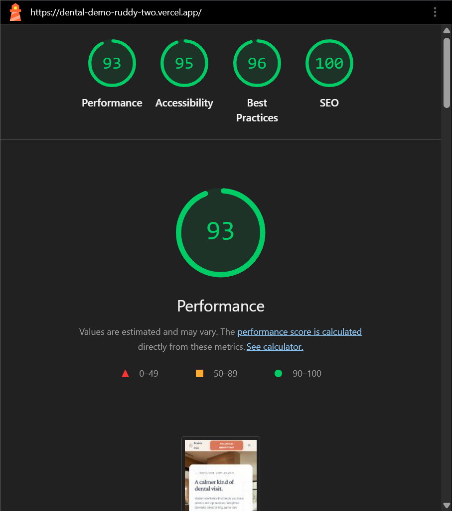
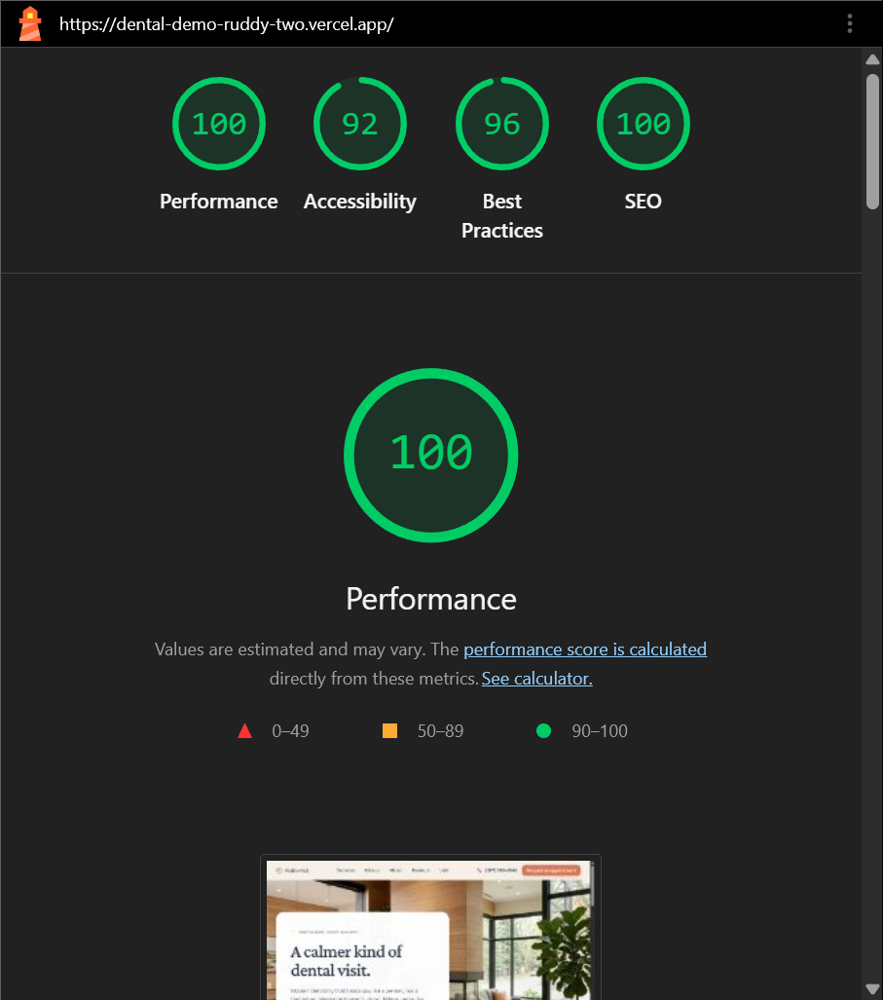

# Prairie Oak Dental Studio — Calgary, AB

**Live:** [dental-demo-ruddy-two.vercel.app](https://dental-demo-ruddy-two.vercel.app)

---

A warm, community-focused boutique dental landing page built from brief to live deployment in under a day. AI-assisted from research through design tokens, spec-driven implementation, and Lighthouse-gated CI. Designed to feel like a modern Alberta home — warm wood textures, natural light, cozy fireplace — not a sterile clinic.

## Lighthouse Scores

CI-verified, 3-run median. Updated every PR.

| Mobile | Desktop |
|--------|---------|
|  |  |

**Current thresholds:** Performance 90+ · Accessibility 90+ · Best Practices 79+ · SEO 90+

## Features

- **Calendly inline scheduling** — 3-step booking wizard (intake → schedule → confirmation) with postMessage error handling, theme-aware skeleton loader, and same-day emergency embed in dark theme
- **WCAG 2.1 AA accessibility** — skip-to-content, `aria-live` regions, keyboard-nav accordions, `prefers-reduced-motion` guards, `role="region"` landmarks on all 11 sections, decorative elements hidden from screen readers
- **JSON-LD structured data** — full `Dentist` schema with opening hours, address, phone, aggregate rating (4.9 / 312 reviews), and price range
- **SEO foundation** — dynamic `sitemap.xml`, `robots.txt`, Open Graph image generation (1200×630), Twitter cards, `en_CA` locale metadata
- **8 reusable UI primitives** — Button, Card, Disclosure, Section, SectionHeader, IconBadge, TextLink, PhoneLink — all polymorphic with variant/size props
- **CI/CD pipeline** — Lighthouse CI (90+ gates on perf/a11y/SEO), Playwright E2E (Chrome + Firefox + WebKit), GitHub Actions on every PR
- **Vercel Analytics** — production-ready with conditional loading (no console errors in local dev)

---

## 📖 The Owner's Story

Prairie Oak Dental Studio was founded by **Dr. Sarah Al-Hussaini** after years of working in high-volume, corporate-owned clinics. Frustrated by an environment where patients felt like numbers on a spreadsheet and appointments were rushed to maximize billing, Dr. Al-Hussaini set out to build a patient-first practice.

Here, patient comfort, transparent clinical communication, and administrative convenience are our primary metrics of success.

## ✨ Core Value Propositions

We do not compete on being the lowest-priced clinic in Calgary; we charge standard rates aligned with the **Alberta Dental Fee Guide**. Instead, we deliver an unrivaled patient experience through:

1. **Anxiety-Free Comfort Menu**: We proactively offer patients complimentary comfort options during treatment, including weighted blankets, noise-canceling headphones, streaming entertainment on ceiling-mounted screens, and mild sedation options for nervous appointments.
2. **True Direct Billing (Assignment of Benefits)**: We handle all insurance paperwork on behalf of the patient. We bill Alberta Blue Cross, Sun Life, Manulife, Canada Life, and other major providers directly. Patients only pay their specific co-pay out-of-pocket on the day of treatment.
3. **Same-Day Emergency Guarantee**: We reserve dedicated emergency slots in our schedule every single day. If you are experiencing sudden oral pain, a broken tooth, or a lost filling, we guarantee to see you the exact same day to get you out of discomfort.

## 🎯 Target Patient Profiles

- **The Busy Professional**: Demands highly efficient care, real-time online scheduling that respects their time, and instant clarity on whether their corporate insurance matches our direct billing system.
- **The High-Anxiety Resident**: Has avoided the dentist for 5 to 10 years due to a past traumatic experience. Self-conscious about their oral health, they need an empathetic, judgment-free environment to get back on track.
- **The Emergency Patient**: A local resident experiencing sudden, severe dental pain. Typically on a mobile device looking for an immediate phone number and a direct promise of same-day relief.

## 🦷 Clinical Service Categories

### 1. General Dentistry & Prevention
Comprehensive oral checkups, dental exams, digital X-rays, professional cleanings, scaling, personalized hygiene plans, and pediatric checkups designed to create a fun, positive foundation for children.

### 2. Restorative & Same-Day Emergency Care
Natural-looking, tooth-colored (composite) fillings, root canal therapy, immediate pain relief protocols, and durable dental crowns, bridges, and implant restorations.

### 3. Cosmetic Transformations & Aligners
Professional in-office laser teeth whitening, custom take-home kits, porcelain veneers to correct chips, minor gaps, or uneven spacing, and Invisalign® clear aligner therapy for subtle adult orthodontic corrections.

---

## 💻 Tech Stack

| Layer | Technology |
|-------|------------|
| Framework | Next.js 16 (App Router, Turbopack) |
| UI | React 19, Tailwind CSS v4, `next/font` |
| Language | TypeScript 5 (strict mode) |
| Scheduling | Calendly inline embed |
| Testing | Playwright (3 browsers), Lighthouse CI |
| Hosting | Vercel |

## 🛠️ Developer Commands

| Task | Command |
|------|---------|
| Development | `npm run dev` |
| Production Build | `npm run build` |
| Production Start | `npm run start` |
| Linting | `npm run lint` |
| E2E Tests | `npm run test:e2e` |
| Lighthouse CI | `npm run test:lighthouse` |

## ⚠️ Next.js 16 & React 19 Guidelines

1. **Routing**: `middleware.ts` is deprecated in Next.js 16. Use `proxy.ts` for intercepting requests.
2. **Image Optimization**: `<Image priority>` is deprecated. Use `<Image preload>` for above-the-fold images.
3. **Async Contexts**: Dynamic APIs like `params`, `searchParams`, `cookies()`, and `draftMode()` are asynchronous. You **must await** them in Server Components and Route Handlers.
4. **Form Hooks**: Use `useActionState` instead of the deprecated `useFormState` hook for React 19 form actions.
5. **Linting**: Use `npm run lint` which executes raw `eslint`. Note that `next lint` has been removed in Next.js 16.
