# Design Spec: Prairie Oak Dental Studio Warm Clinical Overhaul

A comprehensive redesign and refactoring of the Prairie Oak Dental Studio landing page to address architectural smells, layout shifts, accessibility gaps, and complete ground-up translation of manual styling to a unified Tailwind CSS v4 design system.

## Proposed System Architecture

We will implement **Option B: The Next.js 16 Hybrid Island Model**. This architecture separates high-performance, SEO-critical static content (rendered on the server) from lightweight, accessible interactive islands (rendered on the client).

```mermaid
graph TD
    Root[app/layout.tsx] --> Page[app/page.tsx - Server Component]
    Page --> Navbar[components/Navbar.tsx - Client Island]
    Page --> Hero[components/Hero.tsx - Server Component]
    Page --> TrustStrip[components/TrustStrip.tsx - Server Component]
    Page --> Emergency[components/Emergency.tsx - Server Component]
    Page --> Comfort[components/Comfort.tsx - Server Component]
    Page --> Services[components/Services.tsx - Client Island]
    Page --> About[components/About.tsx - Server Component]
    Page --> Reviews[components/Reviews.tsx - Server Component]
    Page --> FaqSection[components/FaqSection.tsx - Client Island]
    Page --> Insurance[components/Insurance.tsx - Server Component]
    Page --> FinalCta[components/FinalCta.tsx - Client Island]
    Page --> Location[components/Location.tsx - Server Component]
    Page --> Footer[components/Footer.tsx - Server Component]
    Page --> BookingForm[components/BookingForm.tsx - Client Island]
    Page --> StickyEmergency[components/StickyEmergencyBar.tsx - Client Island]
```



---

## 🎨 Styling Strategy: Ground-Up Tailwind CSS v4 Theme

All raw custom classes in `globals.css` and hardcoded inline styles in `page.tsx` will be completely replaced with utility-first Tailwind CSS v4 elements. 

### Design System Configuration (`app/globals.css`)
Custom variables will be registered directly under a CSS-first `@theme` block in `globals.css`:
```css
@import "tailwindcss";

@theme {
  /* Warm Clinical Palette */
  --color-wc-bg: #F6F1E8;               /* Warm Alberta home taupe */
  --color-wc-bg-alt: #EFE7D7;           /* High-contrast divider tint */
  --color-wc-surface: #FFFFFF;          /* Clinical dental white */
  --color-wc-surface-accent: #EFE7D7;
  --color-wc-ink: #1F2E40;              /* Primary Slate blue/black for copy */
  --color-wc-ink-soft: #445567;         /* Empathetic secondary gray */
  --color-wc-muted: #7A8593;            /* Captions and timeline marks */
  --color-wc-line: #E5DCC8;             /* Soft organic border separation */
  --color-wc-accent: #D97757;           /* Vibrant Alberta clay-orange for CTAs */
  --color-wc-accent-soft: #F4DDD2;      /* Light overlay highlight for comfort icons */
  --color-wc-accent-glow: rgba(217, 119, 87, 0.25);
  --color-wc-gold: #C9A464;             /* Luxurious gold accent for badges */
  --color-wc-deep: #142233;             /* Deep Midnight Slate for high-contrast bands */

  /* Typography Variables */
  --font-display: var(--font-display);  /* Sora (approachable, friendly geometric) */
  --font-body: var(--font-body);        /* Manrope (highly legible body text) */
  --font-serif: var(--font-serif);      /* Crimson Pro (human-centered premium display) */
}
```

---

## 📸 Media Strategy: Real Photo Integration (No Placeholders)

To enforce the "no placeholders" visual directive, all linear-gradient CSS blocks will be completely replaced by real, high-resolution lifestyle photography saved locally in the `/public` folder and rendered with semantic `next/image` components:

1.  **Hero Photo (`/public/hero_reception.png`):** Cozy reception area styled like a modern Alberta home with warm oak textures, lighting, and an elegant glowing fireplace. Optimized for above-fold performance with `preload` and `fetchpriority="high"`.
2.  **Comfort / Treatment Photo (`/public/treatment_comfort.png`):** A calming, residential-style dental treatment room showcasing a soft cushioned chair, noise-canceling headphones, and a folded warm taupe weighted blanket.
3.  **About Photo (`/public/dr_sarah.png`):** An empathetic, warm, and professional lifestyle portrait of Dr. Sarah Al-Hussaini inside the clinic.
4.  **Office Location Map (`/public/office_map.png`):** A premium, stylized minimalist vector map showing the 14025 Macleod Trail SE location with custom brand coloring.

---

## 🧩 Component Directory Layout & Specifications

### 1. Server-Rendered Components (RSC)
To maximize LCP performance and search-engine indexability:
*   `app/page.tsx`: A lightweight root Server Component that aggregates static page divisions (`<Hero />`, `<TrustStrip />`, etc.) and wires up lightweight client state context triggers for the booking overlays.
*   `components/Hero.tsx`: Semantic above-the-fold layout. Utilizes `<Image preload>` mapping to `public/hero_reception.png` to instantly stabilize LCP.
*   `components/TrustStrip.tsx`: Flexible layout containing financial and convenience trust badges.
*   `components/Emergency.tsx`: Calming Midnight Slate emergency band guiding mobile clicks to immediate calls.
*   `components/Comfort.tsx`: Core value presentation showcasing the anxiety-free menu items.
*   `components/About.tsx`: Implements Dr. Sarah's warm portrait and story details.
*   `components/Location.tsx`: Direct scannable list of operations hours and customized stylized map graphics.
*   `components/Footer.tsx`: Fully semantic footer mapping to quick links, legal parameters, and copyright notes.

### 2. Interactive Client Islands ('use client')
Only interactive segments will run client-side to minimize JS execution overhead:
*   `components/Navbar.tsx`: Implements fixed header layers. Responsive desktop/mobile sections are governed strictly using CSS breakpoint rules (e.g. `hidden lg:flex`), preventing initial SSR layout shifts. Smoothly scrolls the viewport down to the inline `BookingForm`.
*   `components/Services.tsx` & `components/FaqSection.tsx`: Rich accordion components. Interactive trigger buttons declare `aria-expanded` and `aria-controls` hooks linking directly to panel containers.
*   `components/StickyEmergencyBar.tsx`: Uses scroll-triggers to smoothly animate the call bar once a mobile visitor scrolls past the hero.
*   `components/BookingForm.tsx` **[NEW]:** A beautiful, progressive inline request panel capturing the **Option 1 "Warm Comfort" Intake Form**, embedded natively within the landing page to avoid overlay modal intrusion:
    *   *Contact Details:* Full Name, Email, Phone Number.
    *   *Date/Time Preference:* Flexible slots (Morning, Afternoon, Date picker).
    *   *Direct Insurance Billing Request:* Checklist to verify provider (Sun Life, Manulife, Blue Cross, etc.).
    *   *Comfort Selection:* Tickboxes for Weighted Blanket, Noise-Canceling Headphones, Ceiling-Screen Selection, or Sedation Request.
    *   *Same-Day Urgency:* Urgent check to trigger high-priority callback.
    *   *Form Submission:* Uses React 19 `useActionState` and Server Actions under the hood for clean form lifecycle management, displaying inline loading states and validation errors without blocking screen interactions.

---

## ♿ Accessibility & Standards Verification Plan

*   **ARIA States:** All toggled components will undergo a validation sweep ensuring `aria-expanded="true/false"` and parent-child container relations are maintained.
*   **Focus Replacement:** No element will declare pure `outline-none` rules. Focused items will trigger high-visibility orange rings (`outline-wc-accent`) upon tab navigation.
*   **Typographical Quality:** All hardcoded datasets will undergo translation replacing straight typewriter apostrophes/quotes with standard typographer curly elements (`’`, `“`, `”`).
*   **Reduced Motion:** Scroll transitions and sticky bar slide-ins will honor standard media queries for reduced motion (`motion-reduce:transition-none`).
